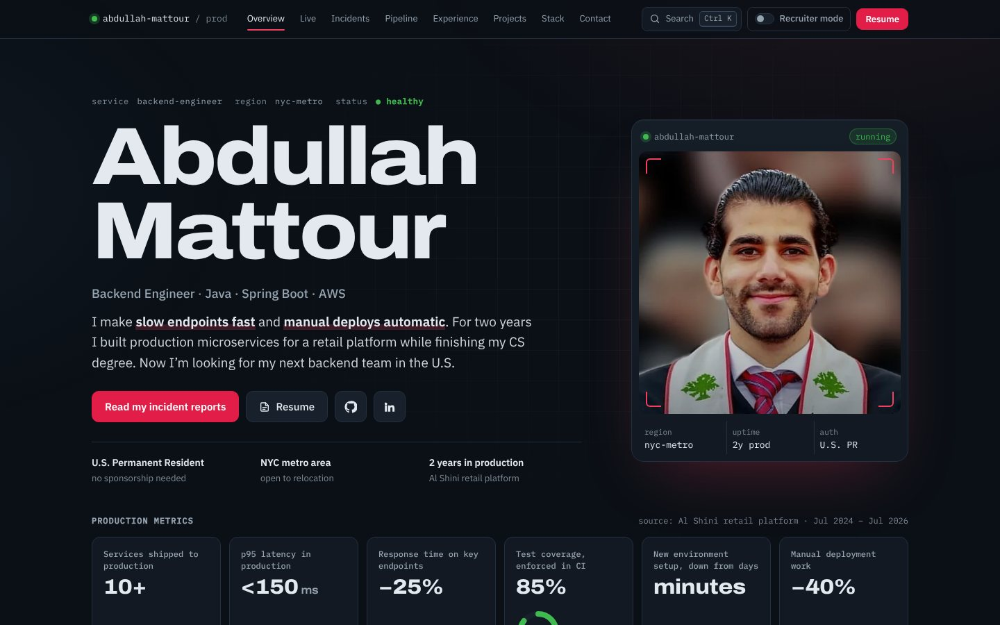
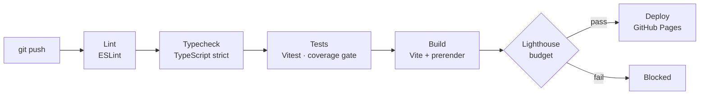

# abdallah-mattour.github.io

[](https://github.com/abdallah-mattour/abdallah-mattour.github.io/actions/workflows/ci.yml)


My portfolio, built like a service I'd run in production: typed, tested, measured, and deployed only by a green pipeline.

**Live:** https://abdallah-mattour.github.io · **Recruiter view (30 seconds):** https://abdallah-mattour.github.io/#recruiter



## How it ships

Every push runs the same kind of pipeline I built at work. If any gate fails, nothing deploys.



| Gate | Threshold |
|:--|:--|
| ESLint (incl. React Hooks rules) | 0 errors |
| TypeScript | `strict`, `noUncheckedIndexedAccess` |
| Vitest test coverage | ≥ 90% lines and statements, ≥ 80% branches |
| Lighthouse, mobile, simulated throttling | Performance ≥ 90, Accessibility · Best Practices · SEO ≥ 95 |

Last local run: **Performance 93 · Accessibility 100 · Best Practices 100 · SEO 100**, 45 tests, 96% line coverage.

A weekly scheduled run rebuilds the site so the build date and the career timeline stay current. Dependabot keeps npm packages and GitHub Actions up to date.

## Engineering notes

- **Prerendered, then hydrated.** The page is rendered to static HTML at build time (`scripts/prerender.mjs`), so it's complete before any JavaScript runs. Search engines and link previews see real content. The stylesheet is inlined and the headline font preloaded to keep first paint fast.
- **Deterministic "live" data.** The latency graph and deploy feed use a seeded random generator, so the server and browser render the identical first frame and hydration never mismatches. The numbers are clearly labeled as a simulated replay; the real metrics come from my production work.
- **Live widgets pause when nobody's watching.** They stop when scrolled off screen, when the tab is hidden, or when the visitor prefers reduced motion.
- **Motion never hides content.** Entrance animations only arm while an element is off screen, and they move things rather than fade them. Anything a visitor or a crawler can see is always fully visible.
- **Keyboard first.** `Ctrl/⌘ K` or `/` opens a command palette (an accessible combobox) to jump to a section, open the resume, copy the email, or run the pipeline simulation.
- **One source of truth for content.** Every fact on the site lives in [`src/data/profile.ts`](src/data/profile.ts).

## Run it locally

Requires Node 22 (see `.nvmrc`).

```bash
npm ci
npm run dev            # local dev server
npm test               # unit and UI tests
npm run test:coverage  # tests with the coverage gate
npm run lint && npm run typecheck
npm run build          # production build + prerender into dist/
npm run preview        # serve dist/
```

## Project structure

```
src/
  data/profile.ts      every fact on the site
  components/          one component per section, plus the command palette
  hooks/               entrance motion, count-up, liveness, intervals, hotkeys
  lib/                 pure logic: latency simulation, pipeline scenarios, command search, timeline
  state/ui.ts          shared UI state (recruiter mode, palette, toasts)
  entry-client.tsx     hydrates the prerendered HTML
  entry-server.tsx     renders the app to a string at build time
scripts/prerender.mjs  injects the rendered HTML, inlines CSS, preloads the headline font
.github/workflows/     CI: lint → typecheck → tests → build → Lighthouse → deploy
```

## License

Code: MIT. Content, photo, and resume: © Abdullah Mattour, all rights reserved.
